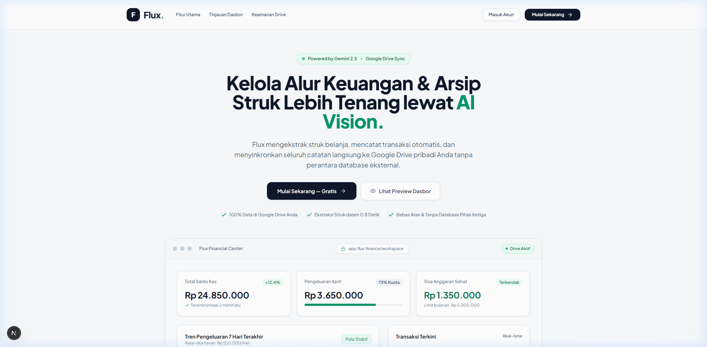
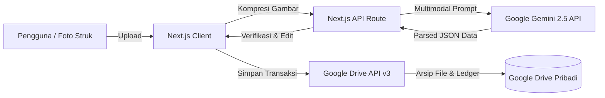

<div align="center">

# Flux — Smart Finance & Receipt Hub

<p align="center">
  <strong>Platform manajemen keuangan pribadi dan arsip struk cerdas berbasis AI Vision dengan kedaulatan data 100% di Google Drive pribadi Anda.</strong>
</p>

[](https://nextjs.org/)
[](https://react.dev/)
[](https://ai.google.dev/)
[](https://developers.google.com/drive)
[](https://tailwindcss.com/)
[](LICENSE)

<br />



</div>

---

## 📌 Daftar Isi

- [Tentang Flux](#-tentang-flux)
- [Filosofi Desain](#-filosofi-desain-clean-light-mode)
- [Fitur Utama](#-fitur-utama)
- [Arsitektur Sistem & Alur Data](#-arsitektur-sistem--alur-data)
- [Tech Stack](#-tech-stack)
- [Struktur Proyek](#-struktur-proyek)
- [Panduan Instalasi](#-panduan-instalasi--menjalankan-lokal)
  - [Prasyarat](#prasyarat)
  - [Konfigurasi Google Cloud Console](#konfigurasi-google-cloud-console)
  - [Variabel Lingkungan (.env.local)](#variabel-lingkungan-envlocal)
  - [Menjalankan Aplikasi](#menjalankan-aplikasi)
- [Keamanan & Privasi](#-keamanan--privasi-data)
- [Pengembang](#-pengembang)

---

## 💡 Tentang Flux

**Flux** adalah platform pencatatan keuangan modern yang mengeliminasi kerumitan input transaksi manual. Dengan memanfaatkan model multimodal **Google Gemini AI**, Flux mampu mengekstrak rincian struk fisik belanja (nama toko/merchant, tanggal, total harga, hingga klasifikasi kategori) dalam hitungan detik.

Berbeda dari aplikasi keuangan konvensional yang menyimpan data pengguna di database server terpusat, Flux mengadopsi prinsip **Zero-Server Storage** — seluruh salinan gambar struk dan buku besar tersimpan langsung di folder **Google Drive** milik pengguna sendiri.

---

## 🎨 Filosofi Desain (Clean Light Mode)

Flux mengusung identitas visual modern bergaya **Light Mode Finansial** yang bersih, fungsional, dan manusiawi:

- **Warm Off-White Canvas (`#F8FAFC`)**: Latar belakang lembut yang nyaman dipandang dalam durasi lama.
- **Pure White Cards (`#FFFFFF`)**: Kartu informasi berbatas tipis 1px (`#E2E8F0`) dan bayangan halus (*subtle soft shadow*).
- **Grounded Financial Accents**: Menggantikan warna ungu neon dengan **Deep Slate** (`#0F172A`) untuk ketegasan hierarki dan **Emerald Green** (`#059669` / `#10B981`) untuk indikator finansial yang sehat.
- **Tipografi Presisi**: Menggunakan font sans-serif modern **Plus Jakarta Sans** dengan kontras warna charcoal (`#111827`).
- **Interactive Bento Grid**: Tata letak modular dengan ikon stroke minimalis dan pill badge pastel.

---

## ✨ Fitur Utama

### 1. 🤖 Ekstraksi Struk Berbasis AI Vision
- Memindai foto struk kasir, faktur, atau bukti transfer dalam waktu sub-detik (rata-rata 0.8 detik).
- Secara otomatis mengenali nama merchant, tanggal transaksi, total nominal (IDR), dan kategori belanja.
- Otomatis melakukan kompresi gambar di sisi klien (*client-side canvas compression*) sebelum dikirim ke AI untuk efisiensi transfer data.

### 2. 🔐 Kedaulatan Data Penuh (Google Drive Sync)
- Autentikasi aman melalui Google OAuth 2.0.
- Menggunakan cakupan izin terisolasi (`drive.file`) — Flux hanya dapat mengakses file yang dibuatnya sendiri di folder khusus Drive Anda.
- Tanpa database pihak ketiga; pengguna memegang kendali 100% atas arsip transaksi mereka.

### 3. 📊 Visual Intelligence & Analytics
- Grafik garis tren pengeluaran harian dengan penanda interaktif (*Recharts*).
- Ringkasan komparasi bulanan dan diagram proporsi pengeluaran per kategori.
- Pemilihan rentang periode dinamis (bulan & tahun).

### 4. ⚠️ Sistem Peringatan Anggaran Cerdas
- Penetapan batas anggaran bulanan fleksibel.
- Indikator peringatan visual otomatis saat pengeluaran mencapai ambang 80% dan 100%.

### 5. 📑 Ekspor Buku Besar CSV Satu Klik
- Unduh seluruh riwayat pembukuan ke format CSV standar akuntansi yang kompatibel dengan Microsoft Excel dan Google Sheets.

---

## 🏛️ Arsitektur Sistem & Alur Data



---

## 🛠️ Tech Stack

| Komponen | Teknologi | Keterangan |
| :--- | :--- | :--- |
| **Framework** | [Next.js 16.2](https://nextjs.org/) | React Server Components & App Router |
| **Library UI** | [React 19.2](https://react.dev/) | Core UI Component Architecture |
| **Styling** | [Tailwind CSS 3.4](https://tailwindcss.com/) | Custom Financial Color Tokens & Clean Shadows |
| **Tipografi** | [Plus Jakarta Sans](https://fonts.google.com/specimen/Plus+Jakarta+Sans) | Google Font via `next/font/google` |
| **Visualisasi** | [Recharts 3.8](https://recharts.org/) | Responsive SVG Charts & Tooltips |
| **AI Multimodal** | [Google Generative AI](https://ai.google.dev/) | Gemini 2.5 Flash Vision Engine |
| **Autentikasi** | [NextAuth.js 4](https://next-auth.js.org/) | Google OAuth 2.0 Provider |
| **Penyimpanan Cloud**| [Googleapis Drive v3](https://developers.google.com/drive) | Sovereign Cloud Storage Integration |

---

## 📁 Struktur Proyek

```text
flux/
├── app/
│   ├── api/
│   │   ├── auth/[...nextauth]/route.js   # Konfigurasi NextAuth Google Provider
│   │   ├── finance/route.js              # Sinkronisasi data transaksi ke Google Drive
│   │   └── gemini/route.js               # Endpoint ekstraksi OCR Google Gemini AI
│   ├── favicon.ico
│   ├── globals.css                       # Design tokens, clean shadows, scrollbar
│   ├── layout.js                         # Root layout dengan Plus Jakarta Sans
│   └── page.js                           # Landing page & authenticated dashboard
├── components/
│   └── Providers.js                      # NextAuth SessionProvider wrapper
├── lib/
│   └── auth.js                           # Helper auth & refresh token Drive
├── public/
│   └── preview.png                       # Mockup preview UI Light Mode
├── .env.local                            # Variabel lingkungan (dikecualikan dari Git)
├── .gitignore                            # Aturan pengecualian Git
├── next.config.mjs                       # Konfigurasi Next.js
├── package.json                          # Manifest dependensi & skrip npm
├── postcss.config.js                     # Konfigurasi PostCSS
└── tailwind.config.js                    # Konfigurasi custom palet warna Flux
```

---

## 🚀 Panduan Instalasi & Menjalankan Lokal

### Prasyarat
- **Node.js** versi 18.17 atau lebih baru
- **npm**, **yarn**, atau **pnpm**
- Proyek aktif di **[Google Cloud Console](https://console.cloud.google.com/)**
- API Key **[Google AI Studio](https://aistudio.google.com/)**

### 1. Kloning Repositori
```bash
git clone https://github.com/willyrafaelfs/Flux.git
cd Flux
```

### 2. Pasang Dependensi
```bash
npm install
```

### 3. Konfigurasi Google Cloud Console
1. Buat proyek baru di Google Cloud Console.
2. Aktifkan **Google Drive API**.
3. Buat kredensial **OAuth 2.0 Client ID** (Web Application):
   - **Authorized JavaScript origins**: `http://localhost:3000`
   - **Authorized redirect URIs**: `http://localhost:3000/api/auth/callback/google`
4. Tambahkan cakupan (scope): `https://www.googleapis.com/auth/drive.file`.

### 4. Variabel Lingkungan (`.env.local`)
Salin atau buat file `.env.local` pada direktori root:

```env
# Google OAuth 2.0 Credentials
GOOGLE_CLIENT_ID=your_google_client_id_here
GOOGLE_CLIENT_SECRET=your_google_client_secret_here

# Google Gemini API
GEMINI_API_KEY=your_gemini_api_key_here

# NextAuth Configuration
NEXTAUTH_URL=http://localhost:3000
NEXTAUTH_SECRET=generate_a_random_32_character_secret_key
```

> **Tips:** Anda dapat menghasilkan `NEXTAUTH_SECRET` menggunakan perintah:  
> `openssl rand -base64 32`

### 5. Menjalankan Server Pengembangan
```bash
npm run dev
```
Buka browser dan navigasikan ke `http://localhost:3000`.

### 6. Build untuk Produksi
```bash
npm run build
npm run start
```

---

## 🛡️ Keamanan & Privasi Data

- **Zero Third-Party Storage**: Flux tidak menyediakan server database untuk menampung rekaman keuangan pengguna. Semua data disimpan langsung di Google Drive pengguna.
- **Izin Terisolasi (`drive.file`)**: Aplikasi hanya dapat melihat dan memodifikasi file yang dibuat oleh Flux sendiri, dan tidak memiliki akses ke dokumen pribadi lain di Google Drive Anda.
- **Enkripsi End-to-End**: Seluruh alur transmisi dilindungi protokol HTTPS/TLS berstandar Google Cloud.

---

## 👨‍💻 Pengembang

**Willy Rafael**  
- Email: [willy.rafaelfs@gmail.com](mailto:willy.rafaelfs@gmail.com)  
- GitHub: [@willyrafaelfs](https://github.com/willyrafaelfs)  
- GitLab: [@willyrafaelfs](https://gitlab.com/willyrafaelfs)

---

<div align="center">
  <sub>Dibangun dengan dedikasi untuk produktivitas keuangan yang bersih, privat, dan mandiri.</sub>
</div>
